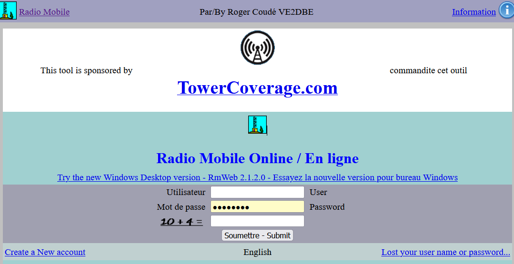
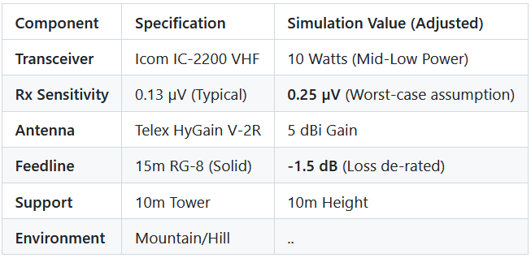
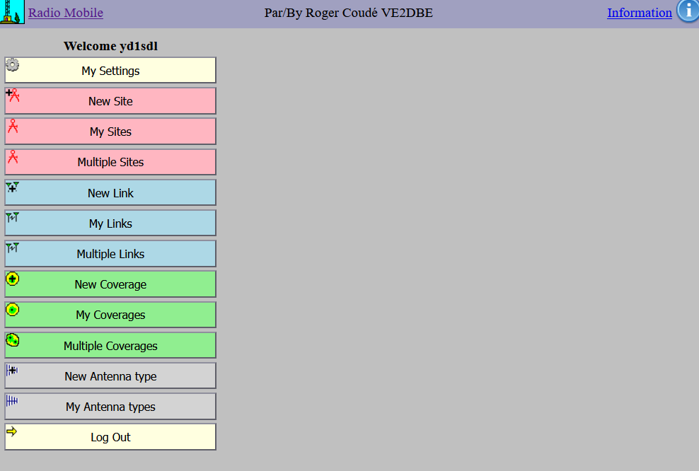
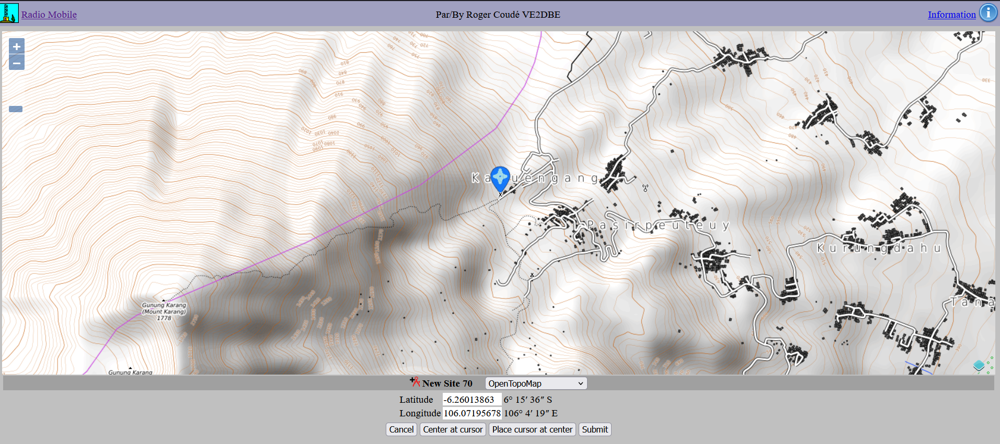
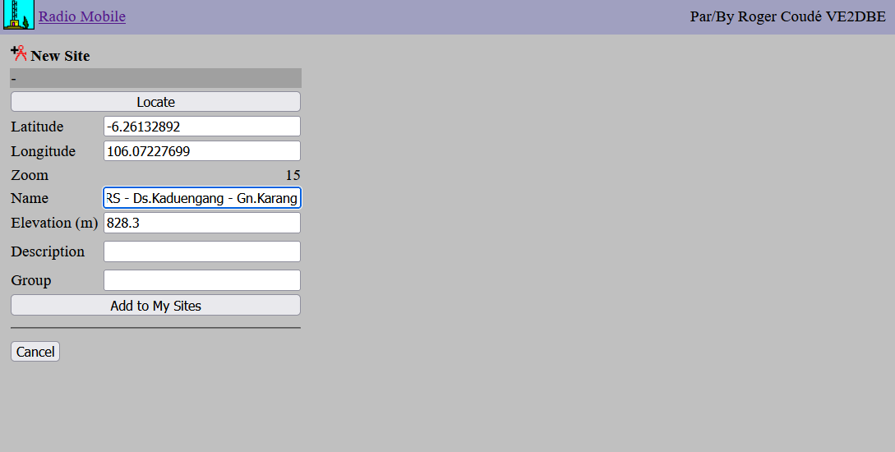
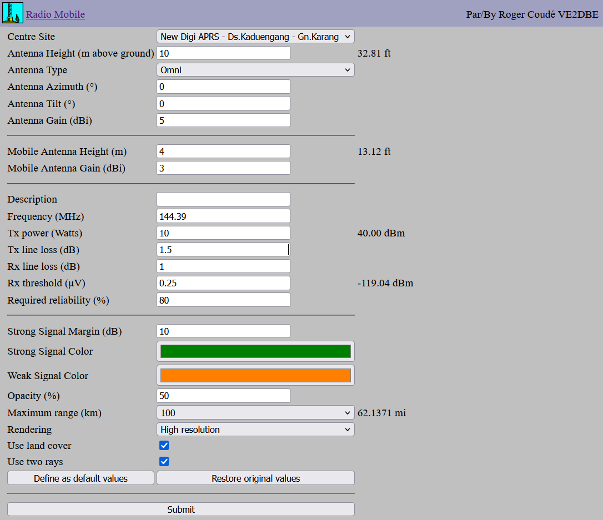
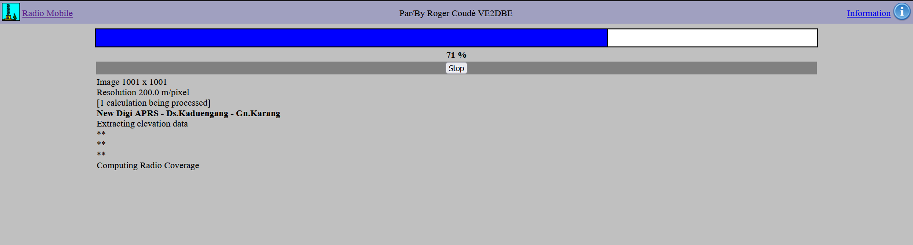
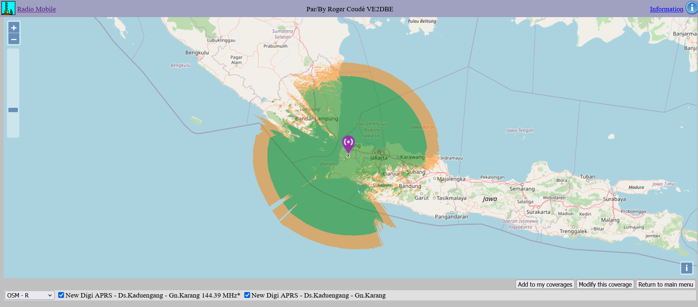
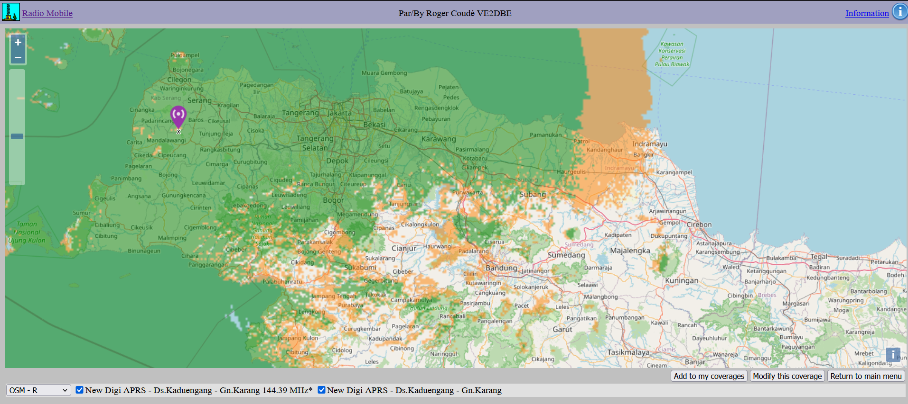
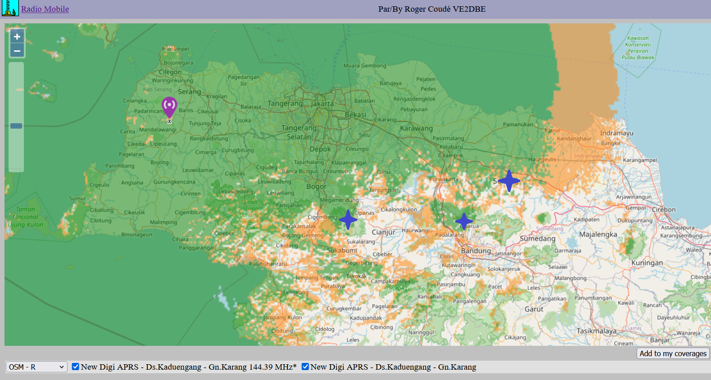

# Amateur Radio Antenna Coverage Simulation: A Beginner's Guide

This tutorial demonstrates how to simulate antenna coverage for a specific amateur radio station using the **"Ray-Tracing"** propagation model. This method is essential for visualizing how terrain and equipment choices impact your signal's reach.

The primary tool used in this guide is [**Radio Mobile Online by VE2DBE**](https://www.ve2dbe.com/rmonline_s.asp). All credit for this powerful simulation engine goes to him.

  

---

## Study Case: APRS Digipeater Installation
We will simulate the installation of an **APRS digipeater** (VHF: 144.390 MHz) located on a mountain or hill. To ensure a realistic simulation, we use "de-rated" values—adjusting ideal specs downward to account for real-world variables like weather and interference.

### Equipment & Environment Constraints

  

<!--
| Component | Specification | Simulation Value (Adjusted) |
| :--- | :--- | :--- |
| **Transceiver** | Icom IC-2200 VHF | 10 Watts (Mid-Low Power) |
| **Rx Sensitivity** | 0.13 µV (Typical) | **0.25 µV** (Worst-case assumption) |
| **Antenna** | Telex HyGain V-2R | 5 dBi Gain |
| **Feedline** | 15m RG-8 (Solid) | **-1.5 dB** (Loss de-rated) |
| **Support** | 10m Tower | 10m Height |
| **Environment** | Mountain/Hill |  ..   |
-->
---

## Step 1: Picking the Location
1. **Open the Tool:** From the main menu, click the **"New Site"** button.

  

2. **Navigate the Map:** Find your preferred location. 
   * *Example:* This tutorial uses **Mt. Karang in Pandeglang (Banten, Indonesia)**.
3. **Set the Pin:** Click **"Place cursor at center,"** drag the pin to your exact spot, and ensure the coordinates are correct before clicking **"Submit"**.

  

4. **Save Site:** Name your location and click **"Add to My Sites"**. It will now appear in your **"My Sites"** menu for future use.

  

---

## Step 2: Defining RF Parameters
Navigate back to the main menu and click **"New Coverage"**. Enter the following parameters based on our case study:

* **Center Site:** Your saved location.
* **Antenna Height:** 10m (Site) / 3m (Mobile/Car).
* **Antenna Gain:** 5 dB (Site) / 3 dB (Mobile).
* **Frequency:** 144.390 MHz.
* **Tx Power:** 10 Watts.
* **Line Loss:** 1.5 dB (Tx) / 1.0 dB (Rx assumption).
* **Rx Threshold:** 0.25 µV.
* **Reliability:** 80% (Assumption).
* **Maximum Range:** 100 – 300 km.

  

Click **Submit** and wait for the calculation to process.

  

---

## Step 3: Evaluating the Results
Once the coverage map is generated, click **"Add to my Coverage"** to save it to your profile.

  

### Interpreting the Map
* **Dark Green:** Strong signal coverage.
* **Dark Orange:** Marginal coverage.
* **Blank Spots:** No coverage (RF shadows).

  

> **Planning Tip:** To expand your network, choose new sites located within the **orange (marginal)** areas. This optimizes coverage overlap and reduces "dead zones" while maintaining redundancy.

  

---

## Summary
This guide provides a basic workflow for evaluating radio repeater sites using Radio Mobile Online. By inputting accurate hardware parameters and terrain data, you can effectively predict performance before ever setting foot on the mountain. 

*Note: These results are for demonstration and should always be verified with on-site field testing.*
