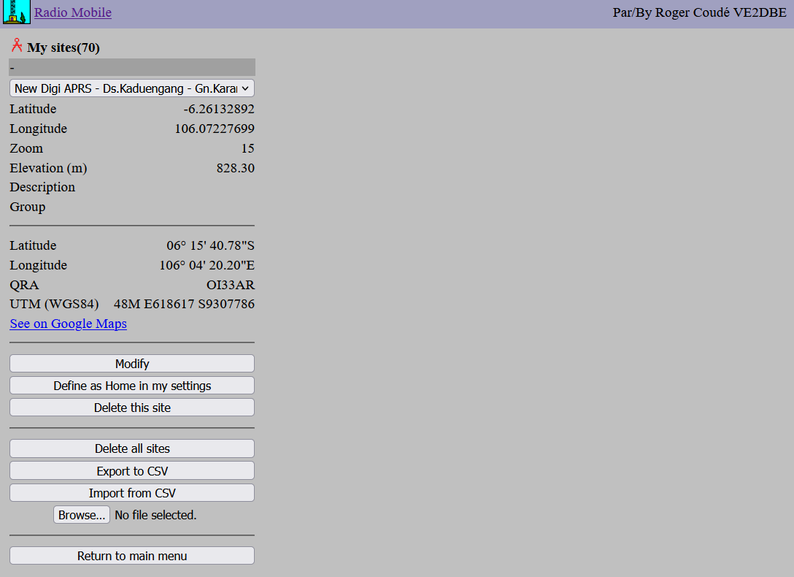

# Amateur Radio Antenna Coverage Simulation (A Beginner Tutorial)
This writing demonstrates how to simulate an antenna coverage from a specific station setup on amateur radio frequency using the "ray-tracing" propagation model.

The tool used in this writing is [**Radio Mobile Online by VE2DBE**](https://www.ve2dbe.com/rmonline_s.asp); therefore, big credits to him.

  

## Study Case
The case that we are going to solve is as follows; 
We are going to install an APRS digipeater (VHF: 144.390 MHz) on a mountain/hill. The equipment that will be used has the following characteristics/constraints:
1. **Icom IC-2200 VHF transceiver**, mid-lo-Tx Power (10 Watts), typical Rx sensitivity (0.13 uV or -120 dBm). This value will be de-rated to -110 dBm to account for the worst case.
2. **Telex HyGain V-2R antenna** (5dBi of Gain)
3. **15m of RG-8 cable**, solid dielectric (1.38 dB of attenuation). This value will be de-rated to -1.5 dB to account for the worst case.
4. **10m high tower**
5. Location is at a mountain/hill.
6. Residential noise level.

The constraints above are a simple-case assumption that more or less describes typical installation conditions.

## Pick the Location
From the main menu, locate the **"New Site"** button and click it.

  

You will be presented with the map. Go ahead, navigate the map to find your preferred location. In this case, I will choose the Mt.Karang in Padeglang (Banten, Indonesia) as my preferred location. Click the **"Place cursor at center"** button, drag the pin, zoom in/out as needed, make sure the location is correct, and click **"Submit"**.

  

You will be redirected to the New Site page. Type the location description and click **"Add to My Sites"**.

  

If you are successful, your location will be listed in the **"My Sites"** menu from the Main Menu options.

  

